# Profit Distribution to Employees using SmartContracts


## Background

A startup has created its own Ethereum-compatible blockchain to help connect financial institutions, and the HR team wants to build smart contracts to automate distributing profits or incentives to eligible employees to make everyone's lives easier, increase transparency, and to make accounting and auditing practically automatic!

In this sudo project we will create 3 `ProfitSplitter` contracts, each of them with increasing in complexity and capability. These contracts will do several things:

* Pay Associate-level employees quickly and easily.

* Distribute profits to different tiers of employees.

* Distribute company shares for employees in a "deferred equity incentive plan" automatically.


### PreRequistes:

* [Remix IDE](https://remix.ethereum.org) to create the contract using Solidity programming Language.

* [Ganache](https://www.trufflesuite.com/ganache) a Development blockchain with prefunded account addresses which can be uused for testing purposes. 

* [MetaMask](https://metamask.io) a Crypto wallet and gateway to blockchain apps. Download the metamask Browser extension and pin it to your favorite browser and point it to the localhost:8545 by createting a 'testnet' chain, or replace the port with what you have set in your workspace.

<br>


## The `AssociateProfitSplitter` Contract

[`AssociateProfitSplitter.sol`](AssociateProfitSplitter.sol) -- This will accept Ether into the contract and divide the Ether evenly among the associate level employees. This will allow the Human Resources department to pay employees quickly and efficiently.

<details><summary>  <b> Setting up the contract </b></summary>

- Using the following `public` variables, We will setup the contract between the HR Team and the employees or the benificiaries to whom we want to distribute the incentives or profits.  

  - `employee_one` -- The `address` of the first employee. Make sure to set this to `payable`.

  - `employee_two` -- Another `address payable` that represents the second employee.

  - `employee_three` -- The third `address payable` that represents the third employee.

  - `owner` -- the owner of the contract or the HR department address that deposits the ether to the employees. defaulted to msg.sender in the contract contructor function.

</details> <br>

### Contract functions: 

<details><summary> <b> 
`constructor`: </b> </summary>

Initializes the contract with and presets the employee addresses to equal the parameter values. This will allow us to avoid hardcoding the employee addresses.:

- params:

  -  `address payable _one`

  - `address payable _two`

  - `address payable _three`

</details>

<details><summary> <b> 
`balance`: </b> </summary>

  - This function returns the contract's current balance. Since the contract   is set to distribute Ether or profits to the beneficiaries without hodling any balance within the contract, this function always return `0`. if there are any balances left after distribution due to the fractional remainder, the balance is sent back to the depositor or the sender, in this case the HR Department. 

  - functon is declared as `public view` as it does not modify the contract state or the memory, but can read from them.

  - params : none. reads the address(this) to fetch the contract balance
  - returns: contract balance ensuring no ether is withheld in the contract

</details>

<details><summary> <b> 
`deposit` </b> </summary>

  - This function is defined as  `public payable` as it transfers the funds/ether to the beneficiaries. We enforce this fuunction to ensure only the owner can call the function using the require condition.

  - function performs the following steps:

    - Sets a `uint amount` to equal `msg.value / 3;` in order to calculate the split value of the Ether.

    - for each of the employee listed in the contract, this function transfers the `amount` calcuated by previous step.

    - Since `uint` only contains positive whole numbers, and Solidity does not fully support float/decimals, we must deal with a potential remainder at the end of this function since `amount` will discard the remainder during division.

    - We may either have `1` or `2` wei leftover, so transfer the `msg.value - amount * 3` back to `msg.sender`. This will re-multiply the `amount` by 3, then subtract it from the `msg.value` to account for any leftover wei, and send it back to Human Resources.

  -  params: none. reads the global vairables msg.sender and owner to verify only owner is able to deposit
  -  returns: none. calls the `balance` function internally to update the contract balance 

</details>

<details><summary> <b> 
`fallback` function </b> </summary>
  
  - fallback function declared as `external payable`, calls the `deposit` function from within it. This will ensure that the logic in `deposit` executes if Ether is sent directly to the contract. This is important to prevent Ether from being locked in the contract since we don't have a `withdraw` function in this use-case.

  - params: none
  - returns: none. calls deposit function to capture the ether sent directly to the contract

</details>

<br>
<details><summary> <b> 
Deploying the contract </b> </summary>

- In the `Deploy` tab in Remix, deploy the contract to local Ganache chain by connecting to `Injected Web3` and ensuring MetaMask is pointed to `localhost:8545`.

 - Prior to deploying, fill in the constructor parameters with designated `employee` addresses.

- Test the `deposit` function by sending various values. Keep an eye on the `employee` balances as you send different amounts of Ether to the contract and ensure the logic is executing properly.

- <table> <tr> <td>
- deploy the contract by entering the employee addresses
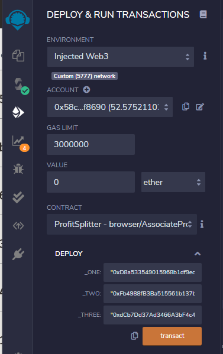 </td> <td>

- enter the amount to be distributed in the 'value' field and select the denomination (wei, gwei, fenney or Ether)
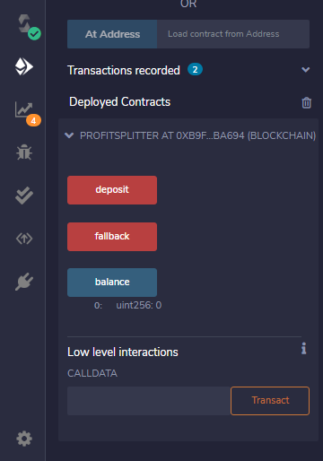 </td> </tr>

<tr> <td>

 </td> <td>
 </td> </tr>

</table>

</details>

<br>

## The `TieredProfitSplitter` Contract

[`TieredProfitSplitter.sol`](TieredProfitSplitter.sol)  -- In this contract, rather than splitting the profits between Associate-level employees, HR wanted to distribute different percentages of incoming Ether to employees at different tiers/levels. For example, the CEO gets paid x%, CTO y%, and COO gets z%.


### Contract functions: 

<details><summary> <b> 
`constructor`: </b> </summary>

Initializes the contract with  predefined employee addresses and the %age share to equal the parameter values. This will allow us to avoid hardcoding the employee addresses anad the %share distribution. These values are set in stone at the time of contract creation and will remain the same through the contract life. 

- params:

  -  `address payable ceo`

  - `address payable cto`

  - `address payable coo`

  - `uint ceo_share`

  - `uint cto_share`

  - `uint coo_share`


</details>

<details><summary> <b> 
`deposit`: </b> </summary>


- This function is defined as  `public payable` as it transfers the funds/ether to the beneficiaries. We enforce this fuunction to ensure only the owner can call the function using the require condition.

- function performs the following steps:

  - Calculates the number of points/units by dividing `msg.value` by `100` representing a percentage of the value to be shared. For example, `points * 60` will output a number that is ~60% of the `msg.value`.

  - For each employee, calculates the amount to be sent using `amount` to equal the number of `points` multiplied by the percentage (say, 60 for 60%).

  - After calculating the `amount` for the first employee, adds the `amount` to the `total` to keep a running total of how much of the `msg.value` are distributed so far.

  - Transfers the `amount` to `employee_one` and Repeats the steps for each employee, setting the `amount` to equal the `points` multiplied by their given percentage.

  - Sends the remainder to the employee with the highest percentage by subtracting `total` from `msg.value`, and sending that to an employee.

</details>

</details>

<details><summary> <b> 
`balance`: </b> </summary>

  - This function returns the contract's current balance. Since the contract   is set to distribute Ether or profits to the beneficiaries without hodling any balance within the contract, this function always return `0`. if there are any balances left after distribution due to the fractional remainder, the balance is sent back to the depositor or the sender, in this case the HR Department. 

  - functon is declared as `public view` as it does not modify the contract state or the memory, but can read from them.

  - params : none. reads the address(this) to fetch the contract balance
  - returns: contract balance ensuring no ether is withheld in the contract

</details>

  <details><summary> <b> 
`fallback` function </b> </summary>
  
  - fallback function declared as `external payable`, calls the `deposit` function from within it. This will ensure that the logic in `deposit` executes if Ether is sent directly to the contract. This is important to prevent Ether from being locked in the contract since we don't have a `withdraw` function in this use-case.

  - params: none
  - returns: none. calls deposit function to capture the ether sent directly to the contract

</details>
<br>

<details><summary> <b> 
Deploying the contract </b> </summary>

- In the `Deploy` tab in Remix, deploy the contract to local Ganache chain by connecting to `Injected Web3` and ensuring MetaMask is pointed to `localhost:8545`.

 - Prior to deploying, fill in the constructor parameters with designated `employee` addresses and %age share to be distributed to each of these employees.

- Test the `deposit` function by sending various values. Keep an eye on the `employee` balances as you send different amounts of Ether to the contract and ensure the logic is executing properly.

- <table> <tr> <td>
- contract compilation
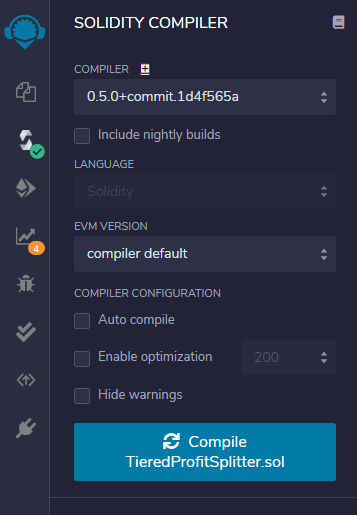 </td> <td>

- deploy the contract by entering the addresses and %share for each tier
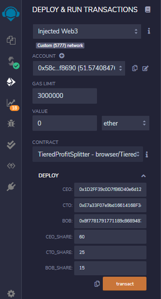 </td> </tr>

<tr> <td>

- initiate the transaction
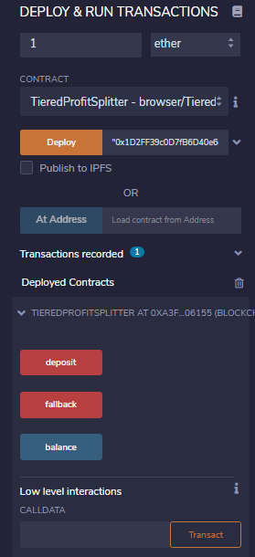 </td> <td>

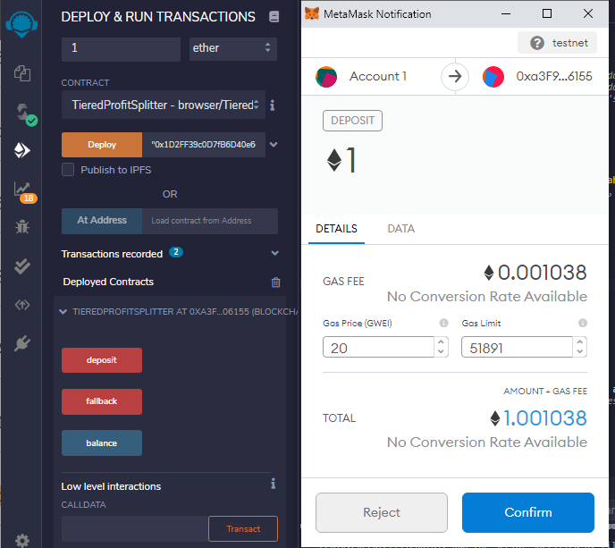 </td> </tr>

</table>

</details>

<br>

## The `DeferredEquityPlan` Contract

[`DeferredEquityPlan.sol`](DeferredEquityPlan.sol) -- models traditional company stock plans with vesting period. In this contract, we will be managing an employee's "deferred equity incentive plan" in which 1000 shares will be distributed over 4 years to the employee. We won't need to work with Ether in this contract, but we will be storing and setting amounts that represent the number of distributed shares the employee owns and enforcing the vetting periods automatically.

### Contract functions: 

<details><summary> <b> 
`constructor`: </b> </summary>

- Human Resources will be set up as the owner of the contract in the constructor as the `msg.sender`, since HR will be deploying the contract.

- sets the contract initialization variables: 

  - bool `active` = true -- indicating the contract is active. This will enable to set the flag to inactive should either HR or the employee decides to exit of the contract.
  
  - sets the `total_shares` to `1000` - this is total number of shares to be distributed in 4 years

  - `annual_distribution` to `250`. This equates to a 4 year vesting period for the `total_shares`, as `250` will be distributed per year. Since it is expensive (gas estimate) to calculate this in Solidity, we can simply set these values manually. 

  - The `uint start_time = now;` line permanently stores the contract's start date. We'll use this to calculate the vested shares later. 
  
  - `unlock_time` to equal `now` plus `365 days`. --increments each distribution period.

  * `distributed_shares` will track how many vested shares the employee has claimed and was distributed. By default, this is `0`.

</details>
<details><summary> <b> 
`distribute`: </b> </summary>

- This function requires a few conditions to be met before the vested shares are distributed, enforced using `require` statements
  - Require that `unlock_time` is less than or equal to `now`.

  - Require that `distributed_shares` is less than the `total_shares` the employee was set for.

  - Requires only the `owner` (HR) or the `employee` to be able to access this function

- Every time the amount is distributed the account is locked for another 365 days (`unlock_time` += 365 days) in line with the vesting period. After the `require` statements, add `365 days` to the `unlock_time`. 

- The new value for `distributed_shares` is calculated using number of years have passed since `start_time` multiplied by `annual_distributions`.

- finally it checks that in case the employee does not cash out until 5+ years after the contract start, the contract does not reward more than the `total_shares` agreed upon in the contract.

</details>

<details><summary> <b> 
`fastforward`: </b> </summary>

- In order to test the timelock (vesting period) functionality, a new variable called `uint fakenow = now;` is defined in the contract variable declaration section, which is used replacing `now` in every other instance of `now`. 

- `fastforward` function manipulates `fakenow` during testing by allowing us to move the time forward.

- note that evertime we use the `fastforward` function, a transaction is initiated charging the gas for the compute time and power used to calculate the `fakenow` time.  

    ```solidity
    function fastforward() public {
        fakenow += 200 days;
    }
    ```
</details>
<details><summary> <b> 
`deactivate`: </b> </summary>

- This function deactivates the contract in case either the employee or the HR wants to terminate for any reason such as employee resignation etc., 

- Can be only be accessed or deactivated by HR or the employee. enforced via `requires` statement.

- once deactivated, the contract `active` flag is set to `false` and can never be reset back to true.


</details>

<details><summary> <b> 
`fallback` function </b> </summary>
  
  - fallback function declared as `external payable`, calls the `deposit` function from within it. This will ensure that the logic in `deposit` executes if Ether is sent directly to the contract. This is important to prevent Ether from being locked in the contract since we don't have a `withdraw` function in this use-case.

  - params: none
  - returns: none. calls deposit function to capture the ether sent directly to the contract
</details>
<br>
<details><summary> <b> 
Deploying the contract on localhost:8545 testnet </b> </summary>

- In the `Deploy` tab in Remix, deploy the contract to local Ganache chain by connecting to `Injected Web3` and ensuring MetaMask is pointed to `localhost:8545`.

 - Prior to deploying, fill in the constructor parameters with designated `employee` addresses and %age share to be distributed to each of these employees.

 - Test the `deposit` function by sending various values. Keep an eye on the `employee` balances as you send different amounts of Ether to the contract and ensure the logic is executing properly.

- <table> <tr> <td>
- compile the contract
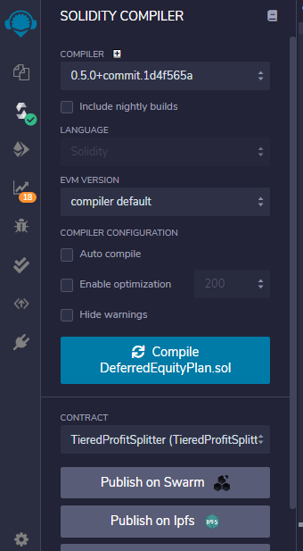 </td> <td>

- deploy the contract by entering the employee address
 </td> </tr>

<tr> <td>

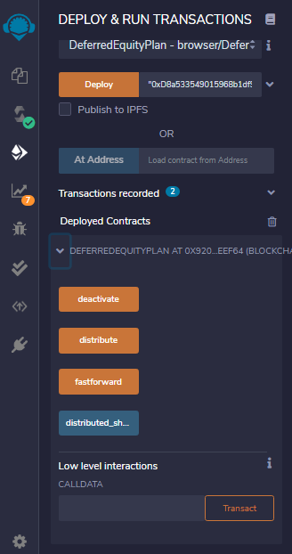 </td> <td> 
- Account is locked for 365 days. Use fastforward function to move the time forward by 365 days to be able to test.
<br>
 </td> </tr>

<tr> <td>

- invoke fastforward two times (200 + 200 days) so the unlock period is less than fakenow and confirm the gas estimate
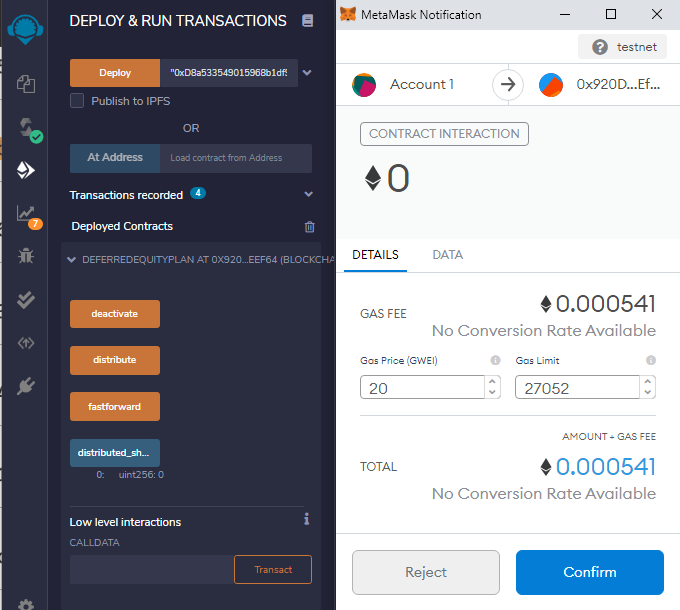 </td> <td>

-  distribute the equity and confirm the gas
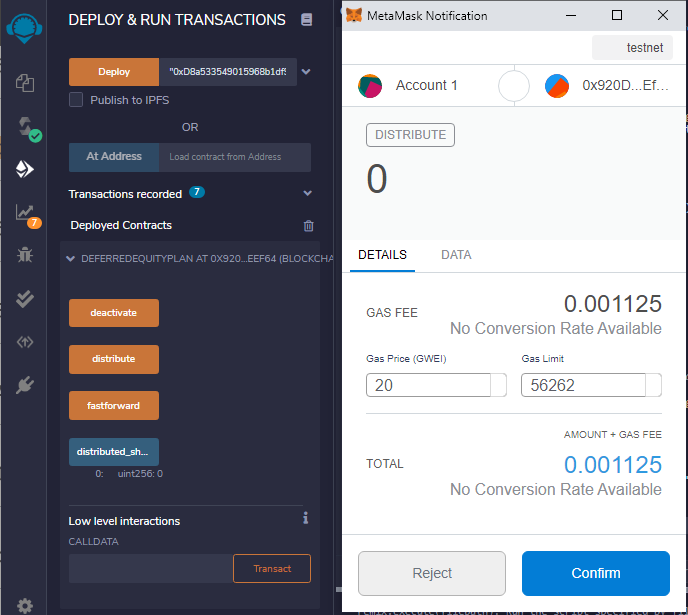 </td> </tr>

<tr> <td>

 </td> <td>

- check the distributed amount
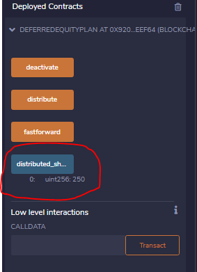 </td> </tr>
</table>

</details>
<br>
<details><summary> <b> 
Deploy the contracts to a live Testnet</b> </summary>

- Point MetaMask to the Kovan or Ropsten network. Ensure you have test Ether on this network. If you dont have test ether you can use [Ropsten faucet](https://faucet.ropsten.be/) to request ether.

- After switching MetaMask to Ropsten, deploy the contracts the same way it was deployed on localhost:8545 or local testnet and copy/keep a note of their deployed addresses. Ensure the Injected web3 is selected and 'Ropsten (3) network' is displayed below the environment field. The transactions will also be in your MetaMask history, and on the blockchain permanently to explore later. 

- you can verify the transaction on [Etherscan](https://ropsten.etherscan.io/) by searching the transactions based on the address used in our contract.

- <table> <tr> <td>
- Point Metamask to Ropsten Test Network
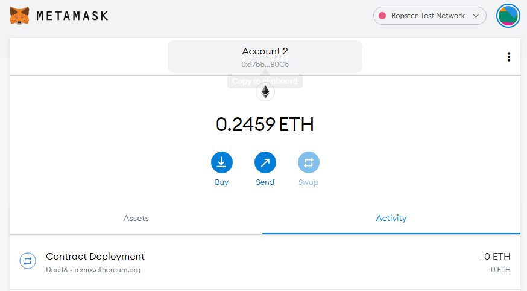 </td> <td>

- Deploy the contract on Ropsten Testnetwork
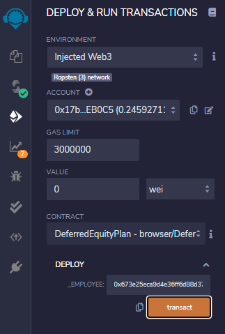 </td> </tr>

<tr> <td>
- try distributing the equity before the unlock period/vested period

 </td> <td> 
- Account is locked for 365 days. Use fastforward function to move the time forward by 365 days to be able to test.

 </td> </tr>

<tr> <td>

- invoke fastforward two times (200 + 200 days) so the unlock period is less than fakenow and confirm the gas estimate
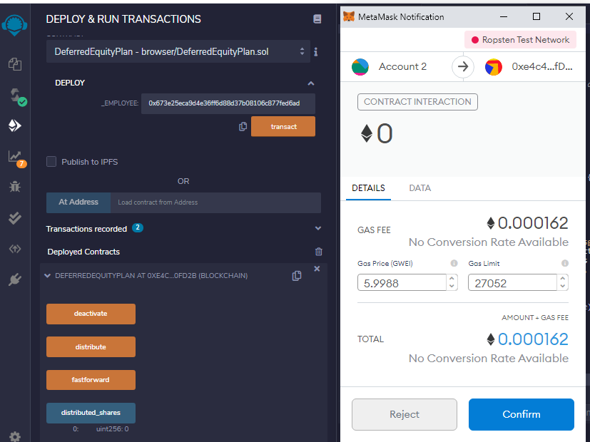 </td> <td>

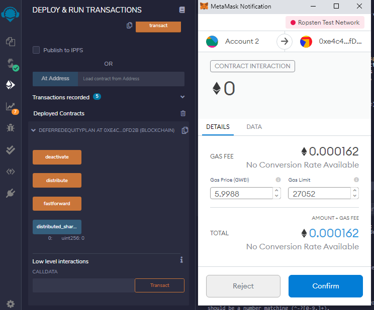 </td> </tr>


<tr> <td>

-  distribute the equity and confirm the gas

 </td> </tr>

<tr> <td>

- check the distributed shares before the transaction
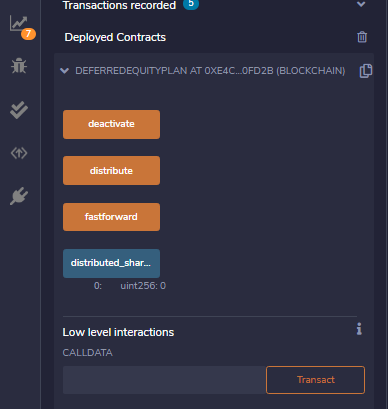 </td> 

<td>

 </td> <td>

- check the distributed shares after the transaction
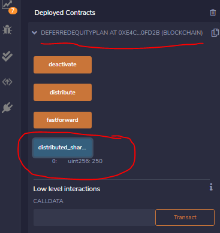 </td> </tr>

<tr> <td>

- check the HR account Balance on metamask after the transaction and the transaction history
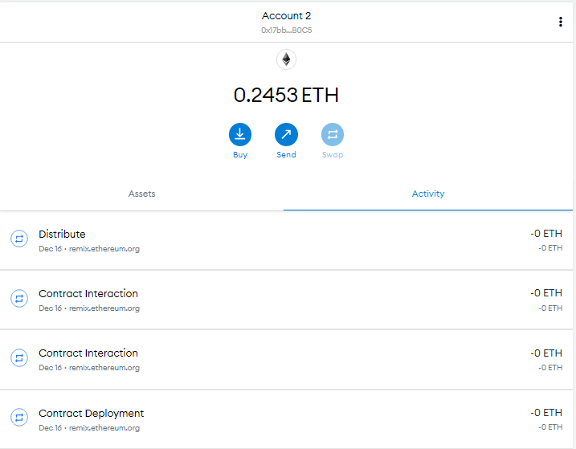 </td> <td>

- check the Transaction history on Ropsten Etherscan using HR account address. 

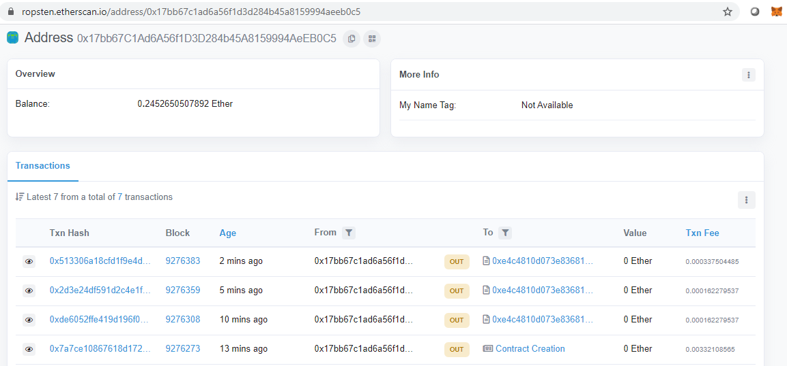 </td> <td>


</table>

</details>

